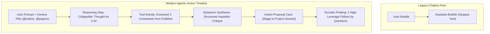

# Design Report: Modern Agentic Chat History & Action Timelines

> **Document Type:** Architectural & UX Design Report  
> **Target Application:** Dialectic Workbench (Auxiliary Socratic Agent Pane)  
> **Prepared For:** Dialectic Product & Engineering  
> **Status:** Proposal & Strategic Blueprint  

---

## 1. Executive Summary: The Paradigm Shift

Traditional conversational interfaces (WhatsApp, Slack, early ChatGPT) were engineered around **conversational speech bubbles**: symmetric, alternating text rectangles pinned to opposite sides of a viewport. 

In modern **Agentic Applications** (such as Cursor Composer, Windsurf Cascade, Devin, Claude Artifacts, and Manus), the speech bubble model is obsolete. Agents do not merely "talk back"; they formulate plans, inspect context, run tools, synthesize data, and stage mutations. Consequently, the chat history has transitioned from a **passive conversation log** into an **action-oriented execution timeline and control surface**.

| Dimension | Legacy Chatbot Paradigm | Modern Agentic Paradigm |
| :--- | :--- | :--- |
| **Mental Model** | Tennis match (User ping $\rightarrow$ Bot pong) | Delegation, Oversight & Steering |
| **Visual Structure** | Alternating speech bubbles | Chronological Action Timeline / Workflow Stream |
| **Reasoning Visibility** | Opaque black box or wall of text | Progressive Disclosure (Collapsible CoT & Tool Steps) |
| **Output Type** | Pure markdown / prose | Multi-modal Action Cards, Diffs, & GenUI |
| **State Mutation** | Bot talks about actions | Bot stages verifiable proposals (Pull Request paradigm) |
| **Human Agency** | Passive recipient | Sovereign Supervisor (Approve, Reject, Steer, Fork) |



---

## 2. Industry Benchmarks & State-of-the-Art Analysis

### 2.1. Cursor (Composer & Agent Mode)
- **Activity Log vs Chat**: Cursor decomposes assistant turns into distinct chronological steps: `Reading 4 files` $\rightarrow$ `Running linter` $\rightarrow$ `Generating edits`.
- **Collapsible File Diffs**: File modifications are not rendered as raw diff text inside bubbles; they appear as compact, interactive file tiles showing `+42 -12 lines` with one-click preview and accept/reject controls.
- **Micro-Status Badges**: Shows execution durations (`4.2s`) and live progress indicators (`Indexing codebase 72%`).

### 2.2. Windsurf (Cascade)
- **Flow Timeline**: Visualizes the entire agentic run as an unfolding "Cascade Flow".
- **Step Accordions**: Each tool call (e.g., executing terminal command, inspecting grep results) is grouped into a collapsible accordion item with status icons (running spinner, green checkmark, red error).
- **Persistent Memories**: Displays a subtle chip strip showing active background rules and memory anchors influencing the current turn.

### 2.3. Devin (Cognition Labs)
- **Timeline & State Preview**: The chat pane is an audit trail. Every turn documents *Intention*, *Action*, and *Observation*.
- **Integrated Browser & Terminal Views**: The timeline links directly to live runtime artifacts (e.g., browser snapshots, terminal outputs).
- **Checkpoints**: Every completed milestone in the timeline serves as a rollback checkpoint if the human supervisor wants to revert the agent's work.

### 2.4. Claude (Artifacts & Projects)
- **Separation of Concerns**: Conversation remains on the chat channel, while long-form content, documents, and code are bifurcated into a dedicated **Artifact Stage** on the side.
- **Versioned Artifact Cards**: The chat displays compact "Artifact Pills" (`Version 2 • Interactive Hypothesis Matrix`) rather than dumping 500 lines of generated text into the stream.

---

## 3. The 5 Core Pillars of Modern Agentic Chat Streams

### Pillar I: Progressive Disclosure (Collapsible Reasoning & Tool Execution)
Agents generate intermediate thoughts, context lookups, and tool payloads that create severe cognitive fatigue if dumped as raw text.
- **Reasoning Disclosures**: A subtle header (`Thought for 3s` or `Epistemic Analysis ∨`) that defaults to collapsed, expandable upon click.
- **Tool Operation Tiles**: Inline cards representing specific operations:
  - `Checked UniProt Database (14 entries matched)`
  - `Stress-tested Assumption #3 (Found 2 contradictory pre-prints)`
  - Each tile can be expanded to inspect parameters and outputs.

### Pillar II: Context Anchoring & Mention Pills
In an agentic workflow, prompts do not exist in a vacuum. Users reference specific project elements.
- **Context Chips**: When a user mentions a file, hypothesis, or citation, the user turn renders with styled chips: `Prompt: Compare @Hypothesis-1 with @Smith-2024-Review`.
- **Active Lens Indicators**: Shows which project resources were in the agent's attention window during that turn.

### Pillar III: Generative Action & Proposal Cards ("AI Proposes, Human Disposes")
Aligned directly with Dialectic’s founding philosophy:
- Rather than saying *"I added this constraint to your notes"*, the agent renders an interactive **Proposal Card**:
  - Title: `Proposed Addition: Wet-Lab Dependency Constraint`
  - Diff Preview: Green highlight of added parameters.
  - CTAs: `[✓ Accept & Stage to Dossier]` and `[✕ Reject]`.

### Pillar IV: Status-Rich Stepper Typography
- **Turn Headers**: Clear differentiation between Human Turns and Agent Turns with metadata (Model tag, timestamp, tokens/sec, latency).
- **Live State Steppers**: During streaming, the assistant turn renders animated status steppers (`Decomposing problem...` $\rightarrow$ `Formulating counter-hypotheses...` $\rightarrow$ `Ready`).

### Pillar V: Turn Checkpointing & Socratic Steering
- **Branching / Forking**: Allowing the user to branch off a previous intellectual crossroad.
- **Interactive Inquisitor Question Chips**: Instead of passive text questions, high-leverage follow-ups are rendered as clickable response suggestions or inquiry buttons that pre-fill the next turn.

---

## 4. Application to Dialectic: The Epistemic Inquiry Stream

Dialectic is not a software coding tool—it is an **epistemic partner for researchers**. We can translate these engineering patterns into intellectual research primitives:

```
┌────────────────────────────────────────────────────────────────────────┐
│                        DIALECTIC AGENT STREAM                          │
├────────────────────────────────────────────────────────────────────────┤
│ [You]  10:42 PM                                                        │
│ I want to use machine learning to predict novel enzyme catalytic rates │
│ from sequence alone, with zero wet-lab access.                         │
│ Context: @NCBI_Benchmark  @AlphaFold3_PDB                              │
├────────────────────────────────────────────────────────────────────────┤
│ [Dialectic Socratic Agent]  gemini-3.1-flash-lite • 1.8s               │
│                                                                        │
│ ┌────────────────────────────────────────────────────────────────────┐ │
│ │ ▾ Epistemic Scrutiny (Reasoning & Assumption Scan)                 │ │
│ │   • Identified hard constraint: Zero wet-lab validation access.    │ │
│ │   • Flagged unexamined assumption: Sequence alone dictates k_cat.   │ │
│ │   • Evaluated falsifiability: PDB binding affinity vs active site. │ │
│ └────────────────────────────────────────────────────────────────────┘ │
│                                                                        │
│ ### Taxonomic Deconstruction                                          │
│ Your proposal hinges on sequence-only quantitative kinetics. However,  │
│ quantitative catalytic rates (\(k_{cat}\)) depend heavily on solvent,  │
│ pH, and dynamics—factors sequence embeddings frequently miss.          │
│                                                                        │
│ ┌────────────────────────────────────────────────────────────────────┐ │
│ │ 📋 STAGED PROPOSAL: Core Research Constraint                       │ │
│ │ Target: Project Dossier / Scope Boundaries                         │ │
│ │ + OUT_OF_SCOPE: In-vitro experimental assay validation              │ │
│ │ + METHOD_BOUND: In-silico benchmark against BRENDA/SABIO-RK         │ │
│ │                                                                    │ │
│ │ [✓ Accept into Dossier]             [✎ Edit Proposal]  [✕ Reject]  │ │
│ └────────────────────────────────────────────────────────────────────┘ │
│                                                                        │
│ ### Socratic Probing                                                   │
│ 1. How will you control for experimental noise across heterogeneous   │
│    literature assay temperatures?                                     │
│ 2. What negative control baseline would falsify your sequence model?  │
│                                                                        │
│ ┌──────────────────────────────────────┐ ┌───────────────────────────┐ │
│ │ [Quick Reply: Focus on SABIO-RK]     │ │ [Explore Falsifiability]  │ │
│ └──────────────────────────────────────┘ └───────────────────────────┘ │
└────────────────────────────────────────────────────────────────────────┘
```

---

## 5. Proposed Component Architecture for Dialectic

To support this modern timeline layout without violating the `<250 lines` clean architecture rule, the stream decomposes into focused modular components:

```
src/components/chat/
├── ChatContainer.tsx                  # Pane wrapper & sticky prompt input
├── timeline/                          # [NEW FEATURE MODULE]
│   ├── AgentTimelineStream.tsx        # Chronological virtualized list of turns
│   ├── UserTurnCard.tsx               # User prompt with context pills (@files)
│   ├── AgentTurnCard.tsx              # Outer container for an agent response turn
│   ├── ReasoningDisclosure.tsx        # Collapsible "Epistemic Scrutiny / Thinking"
│   ├── ToolExecutionStep.tsx          # Collapsible tool/search execution step
│   ├── StagedProposalCard.tsx         # "AI Proposes, Human Disposes" review card
│   └── SocraticInquiryGroup.tsx       # Clickable follow-up inquiry chips
```

---

## 6. Phased Implementation Roadmap

1. **Phase A: Visual Turn Hierarchy & Stepper Typography**
   - Redesign chat items from rounded conversation bubbles into unified turn blocks.
   - Distinctive researcher prompt card vs structured agent timeline card.
   - Header metadata (Model badge, timestamp, duration).

2. **Phase B: Progressive Disclosure (Collapsible Epistemic Reasoning)**
   - Add structured collapsible sections for the model’s reasoning trace (`Epistemic Scrutiny`).
   - Animated streaming indicator showing active sub-phases (`Scrutinizing...`, `Formulating...`).

3. **Phase C: Staged Proposal Cards (The Pull Request Paradigm)**
   - Parse structured proposals from the agent (e.g. JSON blocks or fenced tags).
   - Render interactive `[Accept & Stage]` / `[Reject]` action cards directly in the stream.

4. **Phase D: Interactive Socratic Follow-up Chips**
   - Automatically extract the agent's concluding probing questions and render them as one-click reply chips above the prompt card.

---

> [!NOTE]
> This design report provides the architectural blueprint for upgrading Dialectic's chat stream from simple speech bubbles to a professional, research-grade agentic timeline.
